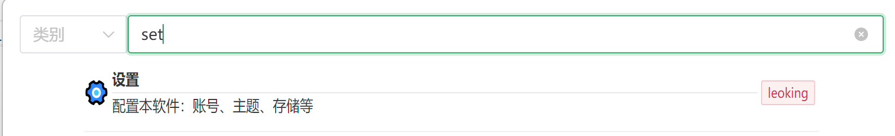
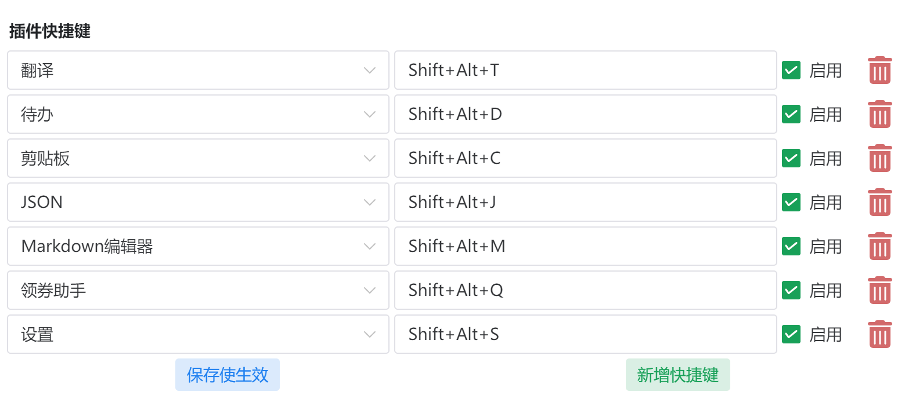

# 快捷键

|快捷键|描述|
|--|--|
|`Alt+D`|隐藏、显示应用|
|`Alt+M`|全屏、还原应用|
|`Alt+W`|分离窗口|
|`Alt+Shift+D`|置顶、取消置顶|
|`Alt+Shift+P`|打开、关闭隐私模式|

除了系统级快捷键之外，IPA还支持用户自定义快捷键：

1. 搜索`设置`并打开

2. 点击`新增快捷键`
3. 编辑快捷键：下拉框选择已安装的目标插件，按键自动录入
4. 勾选`启用`并`保存使之生效`

